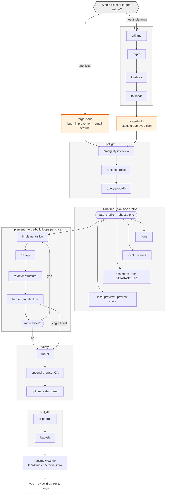

# My Day-to-Day Skills ⚒️

Canonical skill source. After editing, sync:

```bash
./scripts/sync-all.sh          # install
./scripts/sync-all.sh --check  # drift check
```

- [scripts/published.txt](scripts/published.txt) — marketplace plugin (`ai-dev-workflow`)
- [scripts/personal.txt](scripts/personal.txt) — local only

## Workflow

Two orchestration paths. Single tickets skip planning and go straight to preflight; larger multi-slice features plan first, then `forge-build`. Both share the same implement → verify → deliver pipeline.



**Prefix guide:** `to-*` = transform context into an artifact · `forge-*` = run a delivery pipeline · everything else = atomic capability.

## Glossary

### Plan

| Skill       | One-liner                                                                |
| ----------- | ------------------------------------------------------------------------ |
| `grill-me`  | Ask focused questions until scope and behavior are clear enough to plan. |
| `to-prd`    | Turn approved context into `specs/<slug>/PRD.md` on the feature branch.  |
| `to-slices` | Split a PRD into `specs/<slug>/issues/`, commit/push, optional archive.  |
| `to-linear` | Sync the monorepo `specs/<slug>/` plan and slice graph to Linear.        |

### Orchestration

| Skill         | One-liner                                                                                    |
| ------------- | -------------------------------------------------------------------------------------------- |
| `forge-issue` | Deliver one bug, improvement, or small feature — skips planning, goes straight to preflight. |
| `forge-build` | Execute an approved multi-slice plan from `specs/<slug>/` for larger features that needed planning first. |

### Preflight

| Skill            | One-liner                                                                           |
| ---------------- | ----------------------------------------------------------------------------------- |
| `query-prod-db`  | Inspect production data read-only through MCP or `psql` before resolving scope.     |
| `query-local-db` | Query the selected local or task-scoped database safely through a verified env var. |

### Runtime

| Skill                                  | One-liner                                                                             |
| -------------------------------------- | ------------------------------------------------------------------------------------- |
| `provision-neon-branch`                | Standalone: create/rebind/delete a disposable Neon child (not auto-called by forge).  |
| `provision-local-worktree-environment` | Attach previewctl services to a local worktree: Neon, Redis, ports, and `.env.local`. |

### Implement

| Skill                 | One-liner                                                            |
| --------------------- | -------------------------------------------------------------------- |
| `implement-slice`     | Implement one scoped change and leave the diff uncommitted.          |
| `deslop`              | Remove mechanical AI slop from the current diff.                     |
| `prune-dead-code`     | Remove unused symbols and orphaned files across a feature branch.    |
| `refactor-structure`  | Improve folder layout, naming, and file cohesion in scope.           |
| `harden-architecture` | Independently review and fix architectural or control-flow problems. |

### Verify

| Skill             | One-liner                                                                 |
| ----------------- | ------------------------------------------------------------------------- |
| `run-ci`          | Run the repository's relevant CI-equivalent checks without changing code. |
| `to-agent-qa`     | Browser-test, fix, retest, and publish an Agent QA artifact.               |
| `to-agent-demo`   | Record the main feature paths and publish a coworker-ready Agent Demo.     |

Forge still owns its built-in verification. Invoke the personal `to-*` skills when the standalone
Notion artifacts are required.

### Deliver

| Skill     | One-liner                                                                 |
| --------- | ------------------------------------------------------------------------- |
| `to-pr`   | Create or update one draft PR with verification summary and evidence.     |
| `babysit` | Keep an existing draft PR clean, green, and mergeable without merging it. |

### Cleanup

Agent teardown after delivery: delete Neon branches, stop services, clear temp credentials. Preserve local-preview stacks by default.

**Human step (outside skills):** review the draft PR and merge when ready — orchestrators never mark ready or merge.

### Other

| Skill / reference             | One-liner                                                               |
| ----------------------------- | ----------------------------------------------------------------------- |
| `references/specs-repo.md`    | Planning store — resolve from context, bootstrap, paths, commit/push.   |
| `references/host-surfaces.md` | Portable host capability mappings shared across orchestrators.          |
| `preflight-gates.md`          | Shared runtime, evidence, and closeout gates for orchestrators.   |
| `refresh-local-db`            | Refresh local Postgres from a Render production export.                 |
| `design-bake-off`             | Generate multiple UI variants with a dev-only live switcher.            |
| `handoff`                     | Compress the current conversation into a handoff doc for another agent. |
| `write-like-evan`             | Draft Slack, email, or updates in Evan's voice.                         |
