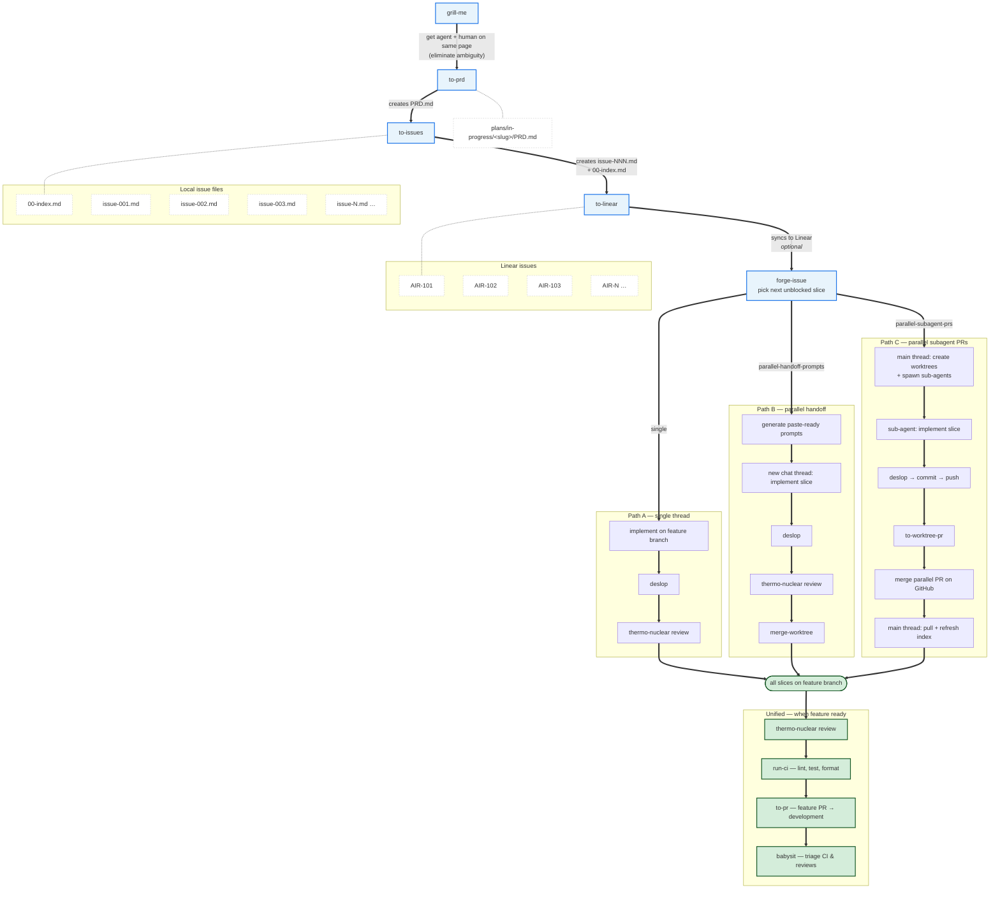

# AI Dev Workflow

Full e2e AI workflow for shipping features!

## Skills

| Skill                                  | Role                                                                          |
| -------------------------------------- | ----------------------------------------------------------------------------- |
| **grill-me**                           | Get agent and human on the same page — eliminate ambiguity                    |
| **to-prd**                             | Master agent-optimized plan — full feature context for downstream agents      |
| **to-issues**                          | Break PRD into issue slices                                                   |
| **to-linear**                          | Sync local plans to Linear                                                    |
| **forge-issue**                        | Pick and implement the next slice (single, handoff, or parallel subagent PRs) |
| **deslop**                             | Clean AI slop from uncommitted changes                                        |
| **thermo-nuclear-code-quality-review** | Strict maintainability review before merge                                    |
| **merge-worktree**                     | Merge parallel handoff branches locally (Path B)                              |
| **to-worktree-pr**                     | Open parallel sub-issue PR from worktree branch (Path C)                      |
| **run-ci**                             | Run local typecheck, lint, test, format                                       |
| **to-pr**                              | Open feature PR to development                                                |
| **babysit**                            | Triage PR comments and CI until merge-ready                                   |

## Workflow

