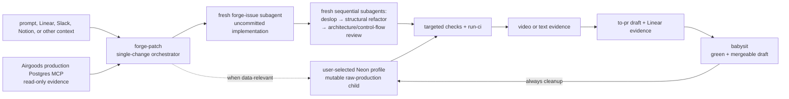
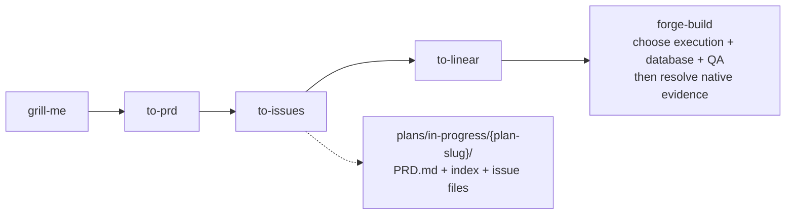

# AI Development Workflow

Two orchestration paths share the same standalone implementation, cleanup, review, verification,
and delivery capabilities.

## Lightweight patch path

Use `forge-patch` for one scoped bug or improvement that does not need a PRD, issue graph, or dependency scheduler.

```mermaid
flowchart LR
  SRC["prompt, Linear, Slack, Notion, or other context"]
  PATCH["forge-patch<br/>single-change orchestrator"]
  ISSUE["fresh forge-issue subagent<br/>uncommitted implementation"]
  REVIEW["fresh sequential subagents:<br/>deslop → structural refactor<br/>→ architecture/control-flow review"]
  CI["targeted checks + run-ci"]
  PROD["Airgoods production Postgres MCP<br/>read-only evidence"]
  NEON["user-selected Neon profile<br/>mutable raw-production child"]
  EVIDENCE["video or text evidence"]
  OUT["to-pr draft + Linear evidence"]
  BABY["babysit<br/>green + mergeable draft"]

  SRC --> PATCH
  PROD --> PATCH
  PATCH -.->|"when data-relevant"| NEON
  PATCH --> ISSUE
  ISSUE --> REVIEW
  REVIEW --> CI
  NEON --> CI
  CI --> EVIDENCE
  EVIDENCE --> OUT
  OUT --> BABY
  BABY -->|"always cleanup"| NEON
```

`forge-patch` supports Codex, local Cursor, and Cursor Cloud. Local runs require a dedicated
non-primary worktree; cloud runs accept the platform's isolated workspace. Unless a concrete
profile is supplied, it always asks for `data: none | local | neon` through the questions UI and
infers `evidence: video | text`, asking about evidence only when ambiguous. When selected,
`$provision-neon-branch` owns the Neon child's full lifecycle; production remains read-only and
the child is deleted after babysit returns the draft PR clean and green. Every
database-dependent process receives the same protected task-scoped handoff and verifies the
selected database identity before use.

## Human-invoked skills

These are the entry points you run directly, in order.

| Skill | Role |
| --- | --- |
| **grill-me** | Resolve planning ambiguity through focused questions |
| **to-prd** | Write the canonical local PRD |
| **to-issues** | Create dependency-aware local implementation issues |
| **to-linear** | Sync the local plan and issue graph to Linear |
| **forge-build** | Choose execution, none/local/Neon database, and none/light/heavy browser-QA profiles, infer native PR evidence, then orchestrate the approved plan through a merge-ready draft PR |

## Execution modes

Choose once when invoking `forge-build`.

| Mode | Issue execution | Integration | Best fit |
| --- | --- | --- | --- |
| **tasks** | One visible issue-orchestrator task per managed worktree; it sequentially spawns fresh `forge-issue`, `deslop`, `refactor-structure`, and thermo-review subagents | Main task polls the terminal contract and cherry-picks its single commit | Recommended in Codex desktop for substantial parallel issues, visibility, and resumability; every task stays unarchived |
| **subagents** | Main task creates one Git worktree per issue and sequentially spawns the same four fresh capability subagents | Main task rebases and fast-forwards the issue branch | Default in Cursor; portable, ephemeral execution with automatic result joins |

The mode controls who orchestrates each issue. Both modes use the same isolated four-subagent
capability pipeline, dependency scheduler, stage reviews, final CI, draft PR creation, and
babysitting.

Cursor defaults directly to `subagents` because it does not support the separate Codex task/worktree thread flow required by `tasks` mode.

## Manual browser QA

Unless supplied or persisted, `forge-build` asks for `qa: none | light | heavy` in the initial
questions UI alongside execution mode and database profile. `none` skips manual browser QA,
`light` covers each changed workflow's happy path, and `heavy` runs broad risk-based scenarios
across affected roles, permissions, boundaries, lifecycle, data states, and regressions.

Manual QA runs after final CI and before draft PR creation. Branch-caused findings go back
through implementation, cleanup, independent review, complete CI, and the full selected QA
profile. Evidence remains a separate later decision and is asked only when it cannot be inferred.

## PR evidence

`forge-build` accepts `evidence: auto | video | text | none`. It resolves `auto` to native video
for user-visible work and text for non-visual work, asking only when the correct profile is
ambiguous. It creates the draft PR after final CI, records or summarizes evidence against that
exact SHA, attaches it through Linear, the PR, or configured private storage, then updates the
same PR body.

## Standalone capabilities

Each capability is directly callable. `forge-patch` and `forge-build` invoke and coordinate them
when running a complete delivery flow.

Both orchestrators pass one canonical `change_contract` through the pipeline. It fixes the source,
scope, exclusions, review base, and exact changed-file manifest so each capability can validate
its boundary without rediscovering the change.

Unless a concrete database profile was supplied or persisted on resume, both orchestrators show
the same structured `none | local | neon` question and mark the safest scope-supported option as
recommended. The Neon option invokes `$provision-neon-branch`; neither orchestrator implements
Neon lifecycle steps itself. Both orchestrators bind and identity-check the selected database for
database-dependent local or cloud applications, migrations, workers, CI, runtime verification,
and evidence; `forge-build` also carries that binding through its selected manual-QA profile.
Connections remain process-scoped: the workflows never edit dotenv files or shell profiles, and
`$query-local-db` follows an isolated target only through an explicit verified environment
variable name.

| Skill | Runs in | Role |
| --- | --- | --- |
| **forge-issue** | Directly or as a dedicated implementation subagent | Implement one scoped change in an isolated checkout and leave it uncommitted |
| **provision-neon-branch** | Directly or conditionally from either orchestrator | Provision, safely rebind, and clean up one disposable production-shaped Neon child |
| **deslop** | Directly or as a dedicated cleanup subagent | Clean the current uncommitted diff |
| **refactor-structure** | Directly or as a dedicated issue or stage-closeout subagent | Explicitly improve folder grouping, file and folder naming, and oversized files |
| **thermo-nuclear-code-quality-review** | Fresh issue, stage, or PR-fix reviewer subagent | Independently review and fix the scoped diff |
| **run-ci** | Main orchestrator task | Run final local CI after implementation or integration |
| **to-pr** | Main orchestrator task | Create or update the single PR with selected evidence links |
| **babysit** | Main orchestrator task, with fresh PR-fix reviewers | Keep the PR clean and green without merging |

## Workflow

### Human-invoked flow

```mermaid
flowchart LR
  GM["grill-me"]
  PRD["to-prd"]
  ISS["to-issues"]
  LIN["to-linear"]
  BUILD["forge-build<br/>choose execution + database + QA<br/>then resolve native evidence"]

  GM --> PRD
  PRD --> ISS
  ISS --> LIN
  LIN --> BUILD
  ISS -.-> PLAN["plans/in-progress/{plan-slug}/<br/>PRD.md + index + issue files"]
```

### Agent loop inside `forge-build`

The selected mode creates two issue-execution branches that converge before shared stage and PR closeout. Green nodes are visible Codex tasks, blue nodes are spawned subagents, and uncolored nodes run in the main task.

```mermaid
flowchart TB
  PREFLIGHT["main: validate plan + dependency graph<br/>persist mode + database + QA + evidence"]
  DB{"persisted database profile"}
  NEON_DB["main: provision-neon-branch<br/>provision/rebind disposable child"]
  HITL["main: resolve HITL gates<br/>ask human only when needed"]
  SCHEDULE["main: schedule eligible issues<br/>parallel when safe"]
  MODE{"selected execution mode"}

  TASK_CREATE["main: create issue-orchestrator task<br/>with managed worktree"]
  TASK_ORCH["issue task: coordinate + validate<br/>sequential capability results"]
  TASK_IMPL["fresh subagent: forge-issue"]
  TASK_CLEAN["fresh subagent: deslop"]
  TASK_STRUCTURE["fresh subagent: refactor-structure"]
  TASK_REVIEW["fresh subagent: thermo-nuclear review"]
  TASK_COMMIT["issue task: commit once<br/>return commit SHA"]
  TASK_INTEGRATE["main: poll task contract<br/>cherry-pick commit"]

  SUB_WORKTREE["main: create dedicated Git worktree"]
  SUB_IMPL["fresh subagent: forge-issue"]
  SUB_CLEAN["fresh subagent: deslop"]
  SUB_STRUCTURE["fresh subagent: refactor-structure"]
  SUB_REVIEW["fresh subagent: thermo-nuclear review"]
  SUB_COMMIT["main: commit issue worktree"]
  SUB_INTEGRATE["main: rebase + fast-forward<br/>feature branch"]

  STAGE_COMPLETE{"stage complete?"}
  SPAWN_STRUCTURE["main: spawn fresh structural-refactor subagent"]
  STAGE_STRUCTURE["subagent: refactor-structure<br/>stage audit"]
  SPAWN_STAGE["main: spawn fresh stage-review subagent"]
  STAGE_REVIEW["subagent: thermo-nuclear stage review"]
  MORE{"issues remaining?"}
  CI["main: run-ci<br/>repairs use the same four-subagent pipeline"]
  QA{"persisted QA profile"}
  QA_LIGHT["main: light browser QA<br/>changed happy paths"]
  QA_HEAVY["main: heavy browser QA<br/>broad risk-based scenarios"]
  PR["main: to-pr draft mode<br/>evidence pending when selected"]
  EVIDENCE{"persisted evidence profile"}
  VIDEO["main: host-native video<br/>attach MP4"]
  TEXT["main: concise text evidence"]
  PR_UPDATE["main: to-pr draft update<br/>final evidence"]
  BABY["main: babysit<br/>fix + review loop until green"]
  DONE["main: move plan to<br/>plans/completed/"]

  PREFLIGHT --> DB
  DB -->|"none / local"| HITL
  DB -->|"neon"| NEON_DB
  NEON_DB --> HITL
  HITL --> SCHEDULE
  SCHEDULE --> MODE

  MODE -->|"tasks"| TASK_CREATE
  TASK_CREATE --> TASK_ORCH
  TASK_ORCH --> TASK_IMPL
  TASK_IMPL -->|"join + validate"| TASK_CLEAN
  TASK_CLEAN -->|"join + validate"| TASK_STRUCTURE
  TASK_STRUCTURE -->|"join + validate"| TASK_REVIEW
  TASK_REVIEW --> TASK_COMMIT
  TASK_COMMIT --> TASK_INTEGRATE
  TASK_INTEGRATE --> STAGE_COMPLETE

  MODE -->|"subagents"| SUB_WORKTREE
  SUB_WORKTREE --> SUB_IMPL
  SUB_IMPL -->|"join + validate"| SUB_CLEAN
  SUB_CLEAN -->|"join + validate"| SUB_STRUCTURE
  SUB_STRUCTURE -->|"join + validate"| SUB_REVIEW
  SUB_REVIEW --> SUB_COMMIT
  SUB_COMMIT --> SUB_INTEGRATE
  SUB_INTEGRATE --> STAGE_COMPLETE

  STAGE_COMPLETE -->|"no — next wave"| SCHEDULE
  STAGE_COMPLETE -->|"yes"| SPAWN_STRUCTURE
  SPAWN_STRUCTURE --> STAGE_STRUCTURE
  STAGE_STRUCTURE --> SPAWN_STAGE
  SPAWN_STAGE --> STAGE_REVIEW
  STAGE_REVIEW --> MORE
  MORE -->|"yes — next stage"| SCHEDULE
  MORE -->|"no"| CI
  CI --> QA
  QA -->|"none"| PR
  QA -->|"light"| QA_LIGHT
  QA -->|"heavy"| QA_HEAVY
  QA_LIGHT --> PR
  QA_HEAVY --> PR
  PR --> EVIDENCE
  EVIDENCE -->|"video"| VIDEO
  EVIDENCE -->|"text"| TEXT
  EVIDENCE -->|"none"| BABY
  VIDEO --> PR_UPDATE
  TEXT --> PR_UPDATE
  PR_UPDATE --> BABY
  BABY --> DB_CLEAN["main: database cleanup<br/>delete Neon child when created"]
  DB_CLEAN --> DONE

  classDef task fill:#e8f5e9,stroke:#2e7d32,stroke-width:2px
  classDef spawned fill:#e8f4fc,stroke:#1a73e8,stroke-width:2px
  class TASK_ORCH,TASK_COMMIT task
  class TASK_IMPL,TASK_CLEAN,TASK_STRUCTURE,TASK_REVIEW,SUB_IMPL,SUB_CLEAN,SUB_STRUCTURE,SUB_REVIEW,STAGE_STRUCTURE,STAGE_REVIEW spawned
```

CI, QA, and babysit repair loops are collapsed into single nodes so the diagram stays readable;
their detailed retry contracts remain in the skills and QA reference.

Task results do not automatically join the main task, so `forge-build` tracks each task ID and reads its terminal result contract with modest backoff. Every spawned issue task stays unarchived for later inspection; cleanup only happens after a separate explicit user request.

`forge-build` produces exactly one integrated feature branch and one draft PR. When selected, it
also runs the selected manual browser QA profile and produces one native video or concise text
evidence artifact tied to the exact final feature SHA. It never marks the PR ready, merges it,
deploys it, or publishes a release.
