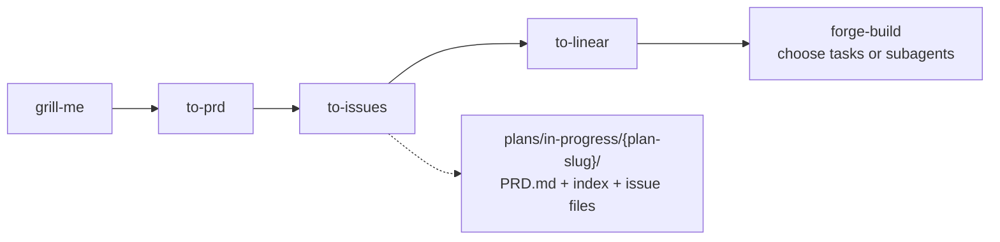

# AI Development Workflow

One end-to-end workflow for turning a clarified idea into a merge-ready draft PR.

## Human-invoked skills

These are the entry points you run directly, in order.

| Skill | Role |
| --- | --- |
| **grill-me** | Resolve planning ambiguity through focused questions |
| **to-prd** | Write the canonical local PRD |
| **to-issues** | Create dependency-aware local implementation issues |
| **to-linear** | Sync the local plan and issue graph to Linear |
| **forge-build** | Choose an execution mode and orchestrate the approved plan through a merge-ready draft PR |

## Execution modes

Choose once when invoking `forge-build`.

| Mode | Issue execution | Integration | Best fit |
| --- | --- | --- | --- |
| **tasks** | One visible Codex task in a managed worktree per issue; the task implements directly and spawns a fresh reviewer subagent | Main task polls the terminal contract and cherry-picks its single commit | Recommended in Codex desktop for substantial parallel issues, visibility, and resumability |
| **subagents** | Main task creates one Git worktree per issue, then spawns separate implementation and reviewer subagents | Main task rebases and fast-forwards the issue branch | Portable, ephemeral execution with automatic subagent result joins |

The mode controls issue implementation. Both modes still use fresh reviewer subagents, the same dependency scheduler, stage reviews, final CI, draft PR creation, and babysitting.

## Agent-run skills

After you start `forge-build`, it invokes and coordinates these skills.

| Skill | Runs in | Role |
| --- | --- | --- |
| **forge-issue** | Issue task directly, or implementation subagent | Implement one assigned issue in its isolated checkout |
| **deslop** | Same issue task/subagent, or main feature workspace for PR fixes | Clean the current uncommitted diff |
| **thermo-nuclear-code-quality-review** | Fresh issue, stage, or PR-fix reviewer subagent | Independently review and fix the scoped diff |
| **run-ci** | Main `forge-build` task | Run final local CI after integration |
| **to-pr** | Main `forge-build` task | Create or update the single feature PR |
| **babysit** | Main task, with fresh PR-fix reviewers | Keep the PR clean and green without merging |

## Workflow

### Human-invoked flow

```mermaid
flowchart LR
  GM["grill-me"]
  PRD["to-prd"]
  ISS["to-issues"]
  LIN["to-linear"]
  BUILD["forge-build<br/>choose tasks or subagents"]

  GM --> PRD
  PRD --> ISS
  ISS --> LIN
  LIN --> BUILD
  ISS -.-> PLAN["plans/in-progress/{plan-slug}/<br/>PRD.md + index + issue files"]
```

### Agent loop inside `forge-build`

The selected mode creates two issue-execution branches that converge before shared stage and PR closeout. Green nodes are visible Codex tasks, blue nodes are spawned subagents, and uncolored nodes run in the main task.

```mermaid
flowchart TB
  PREFLIGHT["main: validate plan + dependency graph"]
  HITL["main: resolve HITL gates<br/>ask human only when needed"]
  SCHEDULE["main: schedule eligible issues<br/>parallel when safe"]
  MODE{"selected execution mode"}

  TASK_CREATE["main: create Codex task<br/>with managed worktree"]
  TASK_EXEC["issue task: forge-issue → deslop"]
  TASK_SPAWN_REVIEW["issue task: spawn fresh reviewer subagent<br/>in the same managed worktree"]
  TASK_REVIEW["reviewer subagent:<br/>thermo-nuclear review"]
  TASK_COMMIT["issue task: commit once<br/>return commit SHA"]
  TASK_INTEGRATE["main: poll task contract<br/>cherry-pick commit"]

  SUB_WORKTREE["main: create dedicated Git worktree"]
  SUB_SPAWN_IMPL["main: spawn implementation subagent<br/>inside issue worktree"]
  SUB_IMPL["implementation subagent:<br/>forge-issue → deslop"]
  SUB_SPAWN_REVIEW["main: spawn fresh reviewer subagent<br/>in the same worktree"]
  SUB_REVIEW["reviewer subagent:<br/>thermo-nuclear review"]
  SUB_COMMIT["main: commit issue worktree"]
  SUB_INTEGRATE["main: rebase + fast-forward<br/>feature branch"]

  STAGE_COMPLETE{"stage complete?"}
  SPAWN_STAGE["main: spawn fresh stage-review subagent"]
  STAGE_REVIEW["subagent: thermo-nuclear stage review"]
  MORE{"issues remaining?"}
  CI["main: run-ci"]
  PR["main: to-pr<br/>draft mode"]
  BABY["main: babysit"]
  PR_FIX{"PR fix needed?"}
  FIX["main: fix + deslop"]
  SPAWN_PR_REVIEW["babysit: spawn fresh PR-fix reviewer subagent"]
  PR_REVIEW["subagent: thermo-nuclear review"]
  DONE["main: move plan to<br/>plans/completed/"]

  PREFLIGHT --> HITL
  HITL --> SCHEDULE
  SCHEDULE --> MODE

  MODE -->|"tasks"| TASK_CREATE
  TASK_CREATE --> TASK_EXEC
  TASK_EXEC --> TASK_SPAWN_REVIEW
  TASK_SPAWN_REVIEW --> TASK_REVIEW
  TASK_REVIEW --> TASK_COMMIT
  TASK_COMMIT --> TASK_INTEGRATE
  TASK_INTEGRATE --> STAGE_COMPLETE

  MODE -->|"subagents"| SUB_WORKTREE
  SUB_WORKTREE --> SUB_SPAWN_IMPL
  SUB_SPAWN_IMPL --> SUB_IMPL
  SUB_IMPL --> SUB_SPAWN_REVIEW
  SUB_SPAWN_REVIEW --> SUB_REVIEW
  SUB_REVIEW --> SUB_COMMIT
  SUB_COMMIT --> SUB_INTEGRATE
  SUB_INTEGRATE --> STAGE_COMPLETE

  STAGE_COMPLETE -->|"no — next wave"| SCHEDULE
  STAGE_COMPLETE -->|"yes"| SPAWN_STAGE
  SPAWN_STAGE --> STAGE_REVIEW
  STAGE_REVIEW --> MORE
  MORE -->|"yes — next stage"| SCHEDULE
  MORE -->|"no"| CI
  CI --> PR
  PR --> BABY
  BABY --> PR_FIX
  PR_FIX -->|"yes"| FIX
  FIX --> SPAWN_PR_REVIEW
  SPAWN_PR_REVIEW --> PR_REVIEW
  PR_REVIEW --> BABY
  PR_FIX -->|"no"| DONE

  classDef task fill:#e8f5e9,stroke:#2e7d32,stroke-width:2px
  classDef spawned fill:#e8f4fc,stroke:#1a73e8,stroke-width:2px
  class TASK_EXEC,TASK_SPAWN_REVIEW,TASK_COMMIT task
  class TASK_REVIEW,SUB_IMPL,SUB_REVIEW,STAGE_REVIEW,PR_REVIEW spawned
```

Task results do not automatically join the main task, so `forge-build` tracks each task ID and reads its terminal result contract with modest backoff.

`forge-build` produces exactly one integrated feature branch and one draft PR. It never marks the PR ready, merges it, deploys it, or publishes a release.
