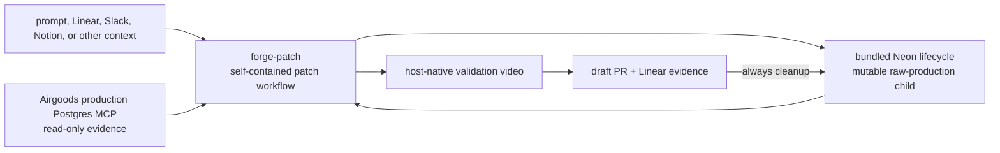
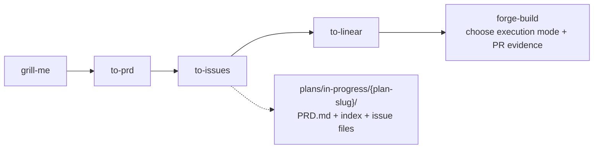

# AI Development Workflow

One end-to-end workflow for turning a clarified idea into a merge-ready draft PR.

## Lightweight patch path

Use `forge-patch` for one scoped bug or improvement that does not need a PRD, issue graph, or dependency scheduler.

```mermaid
flowchart LR
  SRC["prompt, Linear, Slack, Notion, or other context"]
  PATCH["forge-patch<br/>self-contained patch workflow"]
  PROD["Airgoods production Postgres MCP<br/>read-only evidence"]
  NEON["bundled Neon lifecycle<br/>mutable raw-production child"]
  VIDEO["host-native validation video"]
  OUT["draft PR + Linear evidence"]

  SRC --> PATCH
  PROD --> PATCH
  PATCH --> NEON
  NEON --> PATCH
  PATCH --> VIDEO
  VIDEO --> OUT
  OUT -->|"always cleanup"| NEON
```

`forge-patch` supports Codex, local Cursor, and Cursor Cloud. The Neon child may be freely mutated, but production remains read-only and the child is deleted after evidence is delivered.

## Human-invoked skills

These are the entry points you run directly, in order.

| Skill | Role |
| --- | --- |
| **grill-me** | Resolve planning ambiguity through focused questions |
| **to-prd** | Write the canonical local PRD |
| **to-issues** | Create dependency-aware local implementation issues |
| **to-linear** | Sync the local plan and issue graph to Linear |
| **forge-build** | Choose an execution mode and optional PR evidence, then orchestrate the approved plan through a merge-ready draft PR |

## Execution modes

Choose once when invoking `forge-build`.

| Mode | Issue execution | Integration | Best fit |
| --- | --- | --- | --- |
| **tasks** | One visible Codex task in a managed worktree per issue; the task implements directly and spawns a fresh reviewer subagent | Main task polls the terminal contract and cherry-picks its single commit | Recommended in Codex desktop for substantial parallel issues, visibility, and resumability; every task stays unarchived |
| **subagents** | Main task creates one Git worktree per issue, then spawns separate implementation and reviewer subagents | Main task rebases and fast-forwards the issue branch | Default in Cursor; portable, ephemeral execution with automatic result joins |

The mode controls issue implementation. Both modes still use fresh reviewer subagents, the same dependency scheduler, stage reviews, final CI, draft PR creation, and babysitting.

Cursor defaults directly to `subagents` because it does not support the separate Codex task/worktree thread flow required by `tasks` mode.

## PR evidence

Choose once when invoking `forge-build`: both QA and demo sites, demo only, QA only, or neither. Forge persists the choice, generates selected evidence after final CI passes, and includes the private links in the draft PR.

## Agent-run skills

After you start `forge-build`, it invokes and coordinates these skills.

| Skill | Runs in | Role |
| --- | --- | --- |
| **forge-issue** | Issue task directly, or implementation subagent | Implement one assigned issue in its isolated checkout |
| **deslop** | Same issue task/subagent, or main feature workspace for PR fixes | Clean the current uncommitted diff |
| **thermo-nuclear-code-quality-review** | Fresh issue, stage, or PR-fix reviewer subagent | Independently review and fix the scoped diff |
| **run-ci** | Main `forge-build` task | Run final local CI after integration |
| **feature-qa-site** | Fresh QA subagent when selected | Exercise the final branch, publish video-backed verification, and gate acceptance-blocking findings |
| **feature-demo-site** | Fresh demo subagent when selected | Publish a concise video-backed walkthrough of the final CI-passing branch |
| **to-pr** | Main `forge-build` task | Create or update the single feature PR with selected evidence links |
| **babysit** | Main task, with fresh PR-fix reviewers | Keep the PR clean and green without merging |

## Workflow

### Human-invoked flow

```mermaid
flowchart LR
  GM["grill-me"]
  PRD["to-prd"]
  ISS["to-issues"]
  LIN["to-linear"]
  BUILD["forge-build<br/>choose execution mode + PR evidence"]

  GM --> PRD
  PRD --> ISS
  ISS --> LIN
  LIN --> BUILD
  ISS -.-> PLAN["plans/in-progress/{plan-slug}/<br/>PRD.md + index + issue files"]
```

### Agent loop inside `forge-build`

The selected mode creates two issue-execution branches that converge before shared stage and PR closeout. Green nodes are visible Codex tasks, blue nodes are spawned subagents, and uncolored nodes run in the main task.

```mermaid
flowchart TB
  PREFLIGHT["main: validate plan + dependency graph<br/>persist mode + PR evidence choice"]
  HITL["main: resolve HITL gates<br/>ask human only when needed"]
  SCHEDULE["main: schedule eligible issues<br/>parallel when safe"]
  MODE{"selected execution mode"}

  TASK_CREATE["main: create Codex task<br/>with managed worktree"]
  TASK_EXEC["issue task: forge-issue → deslop"]
  TASK_SPAWN_REVIEW["issue task: spawn fresh reviewer subagent<br/>in the same managed worktree"]
  TASK_REVIEW["reviewer subagent:<br/>thermo-nuclear review"]
  TASK_COMMIT["issue task: commit once<br/>return commit SHA"]
  TASK_INTEGRATE["main: poll task contract<br/>cherry-pick commit"]

  SUB_WORKTREE["main: create dedicated Git worktree"]
  SUB_SPAWN_IMPL["main: spawn implementation subagent<br/>inside issue worktree"]
  SUB_IMPL["implementation subagent:<br/>forge-issue → deslop"]
  SUB_SPAWN_REVIEW["main: spawn fresh reviewer subagent<br/>in the same worktree"]
  SUB_REVIEW["reviewer subagent:<br/>thermo-nuclear review"]
  SUB_COMMIT["main: commit issue worktree"]
  SUB_INTEGRATE["main: rebase + fast-forward<br/>feature branch"]

  STAGE_COMPLETE{"stage complete?"}
  SPAWN_STAGE["main: spawn fresh stage-review subagent"]
  STAGE_REVIEW["subagent: thermo-nuclear stage review"]
  MORE{"issues remaining?"}
  CI["main: format + run-ci<br/>bounded repair loop until pass"]
  EVIDENCE["main: load persisted PR evidence choice"]
  QA_SELECTED{"QA selected?"}
  SPAWN_QA["main: spawn fresh QA subagent"]
  QA["subagent: feature-qa-site<br/>publish private verification site"]
  QA_REPAIR["main: acceptance gate<br/>if blocked: repair → review → CI → rerun QA"]
  DEMO_SELECTED{"demo selected?"}
  SPAWN_DEMO["main: spawn fresh demo subagent"]
  DEMO["subagent: feature-demo-site<br/>publish private walkthrough"]
  PR["main: to-pr draft mode<br/>include QA + demo links"]
  BABY["main: babysit<br/>fix + review loop until green"]
  DONE["main: move plan to<br/>plans/completed/"]

  PREFLIGHT --> HITL
  HITL --> SCHEDULE
  SCHEDULE --> MODE

  MODE -->|"tasks"| TASK_CREATE
  TASK_CREATE --> TASK_EXEC
  TASK_EXEC --> TASK_SPAWN_REVIEW
  TASK_SPAWN_REVIEW --> TASK_REVIEW
  TASK_REVIEW --> TASK_COMMIT
  TASK_COMMIT --> TASK_INTEGRATE
  TASK_INTEGRATE --> STAGE_COMPLETE

  MODE -->|"subagents"| SUB_WORKTREE
  SUB_WORKTREE --> SUB_SPAWN_IMPL
  SUB_SPAWN_IMPL --> SUB_IMPL
  SUB_IMPL --> SUB_SPAWN_REVIEW
  SUB_SPAWN_REVIEW --> SUB_REVIEW
  SUB_REVIEW --> SUB_COMMIT
  SUB_COMMIT --> SUB_INTEGRATE
  SUB_INTEGRATE --> STAGE_COMPLETE

  STAGE_COMPLETE -->|"no — next wave"| SCHEDULE
  STAGE_COMPLETE -->|"yes"| SPAWN_STAGE
  SPAWN_STAGE --> STAGE_REVIEW
  STAGE_REVIEW --> MORE
  MORE -->|"yes — next stage"| SCHEDULE
  MORE -->|"no"| CI
  CI --> EVIDENCE
  EVIDENCE --> QA_SELECTED
  QA_SELECTED -->|"yes — both or QA only"| SPAWN_QA
  QA_SELECTED -->|"no — demo only or neither"| DEMO_SELECTED
  SPAWN_QA --> QA
  QA --> QA_REPAIR
  QA_REPAIR --> DEMO_SELECTED
  DEMO_SELECTED -->|"yes — both or demo only"| SPAWN_DEMO
  DEMO_SELECTED -->|"no — QA only or neither"| PR
  SPAWN_DEMO --> DEMO
  DEMO --> PR
  PR --> BABY
  BABY --> DONE

  classDef task fill:#e8f5e9,stroke:#2e7d32,stroke-width:2px
  classDef spawned fill:#e8f4fc,stroke:#1a73e8,stroke-width:2px
  class TASK_EXEC,TASK_SPAWN_REVIEW,TASK_COMMIT task
  class TASK_REVIEW,SUB_IMPL,SUB_REVIEW,STAGE_REVIEW,QA,DEMO spawned
```

CI repair, QA repair/reverification, and babysit repair loops are collapsed into single nodes so the diagram stays readable; their detailed retry contracts remain in the individual skills.

Task results do not automatically join the main task, so `forge-build` tracks each task ID and reads its terminal result contract with modest backoff. Every spawned issue task stays unarchived for later inspection; cleanup only happens after a separate explicit user request.

`forge-build` produces exactly one integrated feature branch and one draft PR. When selected, it also produces a private QA site, a private demo site, or both, and keeps every artifact tied to the exact final feature SHA. It never marks the PR ready, merges it, deploys it, or publishes a release.
