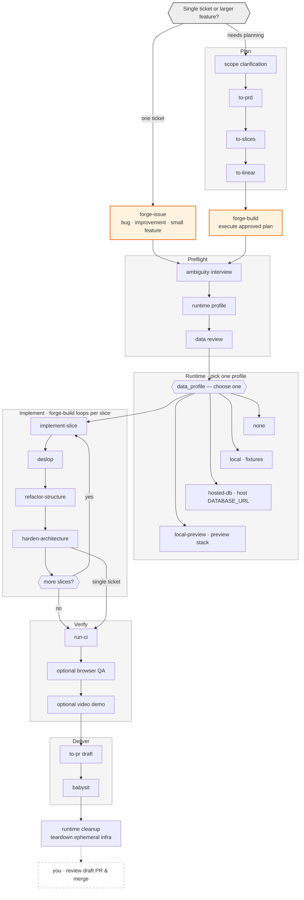

# ai development workflow

## glossary

### plan

| skill       | one-liner                                                                                    |
| ----------- | -------------------------------------------------------------------------------------------- |
| `to-prd`    | turn approved context into `specs/<slug>/PRD.md` on the feature branch.                      |
| `to-slices` | split a prd into `specs/<slug>/issues/`, commit/push, optional archive.                      |
| `to-linear` | sync the monorepo `specs/<slug>/` plan and slice graph to linear.                            |

### orchestration

| skill         | one-liner                                                                                    |
| ------------- | -------------------------------------------------------------------------------------------- |
| `forge-issue` | deliver one bug, improvement, or small feature — skips planning, goes straight to preflight. |
| `forge-build` | execute an approved multi-slice plan from `specs/<slug>/` for larger features that needed planning first. |

### implement

| skill                 | one-liner                                                            |
| --------------------- | -------------------------------------------------------------------- |
| `implement-slice`     | implement one scoped change and leave the diff uncommitted.          |
| `deslop`              | remove mechanical ai slop from the current diff.                     |
| `refactor-structure`  | improve folder layout, naming, and file cohesion in scope.           |
| `harden-architecture` | independently review and fix architectural or control-flow problems. |

### verify

| skill    | one-liner                                                                 |
| -------- | ------------------------------------------------------------------------- |
| `run-ci` | run the repository's relevant ci-equivalent checks without changing code. |

browser qa and evidence capture are orchestrated inside `forge-issue` and `forge-build`, not separate skills.

### deliver

| skill     | one-liner                                                                 |
| --------- | ------------------------------------------------------------------------- |
| `to-pr`   | create or update one draft pr with verification summary and evidence.     |
| `babysit` | keep an existing draft pr clean, green, and mergeable without merging it. |

### cleanup

agent teardown after delivery: delete neon branches, stop services, clear temp credentials. preserve local-preview stacks by default.

**human step (outside skills):** review the draft pr and merge when ready — orchestrators never mark ready or merge.
