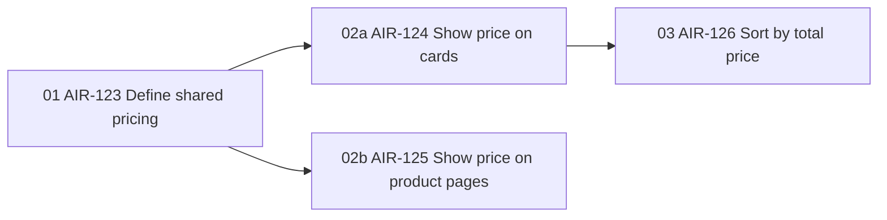

# Parent issue template

Use these headings and this order. Each `+++` pair is one Linear collapsible block. `Rules and edge cases` is a subsection inside Scope, not a separate block. Do not duplicate Linear's native subissue list in the description.

````markdown
+++ ## What are we building?

One short paragraph naming the user, the change, and why it matters.

+++

+++ ## How should it work?

1. The user starts the normal journey.
2. They take the next action and see the result.
3. They complete the journey.

If a decision tree or branching flow is hard to follow in the list, add one Mermaid diagram below it. Keep the numbered list even when a diagram is present.

+++

+++ ## Scope

- List the parts of the product, users, and workflows included.
- Mention an exclusion only when a reader might reasonably assume it is included.

### Rules and edge cases

- State conditions and exceptions that apply across the feature.

+++

+++ ## Subissue dependencies



+++

+++ ## References and inspo

- [Specific design, screenshot, customer example, or document](https://example.com): State what it illustrates.

+++

+++ ## Open questions

- State the unresolved question, owner or next action, and when the answer is needed. If the answer depends on evidence, name the evidence to gather first.

+++
````

The Subissue dependencies diagram is required when the parent has subissues. Include every subissue once, labeled with its stage prefix, actual Linear ID, and a short title. Draw an arrow only for a real native `blocked by` relationship, from prerequisite to dependent. Show independent subissues as unconnected nodes. Replace all example IDs after creating or finding the actual subissues; never publish example IDs. Update the diagram when subissues or blocker links change. It is a quick view of Linear's relationships, not a second source of truth.

Omit `References and inspo` or `Open questions` when empty. Preserve actual screenshots and links from the supplied source. Never substitute the example URL. Keep shared product rules on the parent; a subissue repeats only the rules needed to build that outcome independently.
