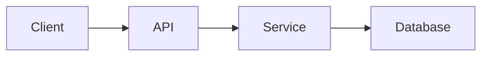
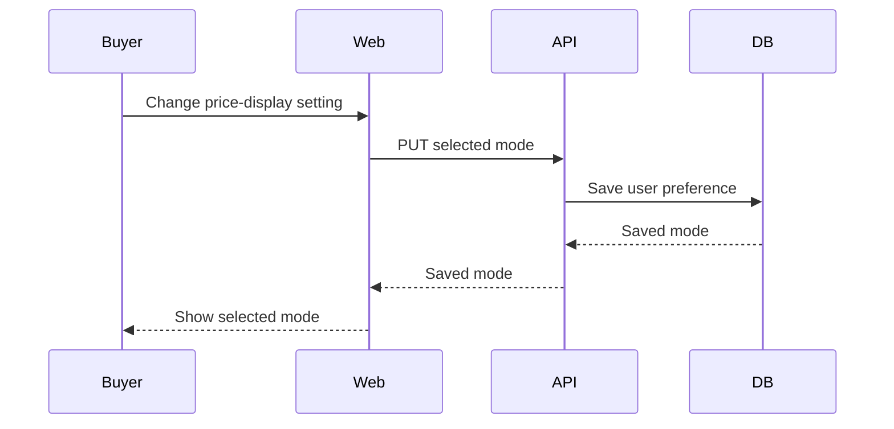

# Tech spec template

This content goes inside the subissue's single collapsible `Tech spec` block. Use the subsection order below. `Design` and `Proposed files` are required when a Tech spec exists. Omit other subsections when they do not apply. Within `API contract`, use `API` for changed endpoints and `Clients` for changed web or mobile callers; omit either subheader when untouched. Never fill a section with `N/A`. The user journey, scope, and acceptance criteria already live above this block.

## Format

````markdown
### Design

A short paragraph explaining the chosen design, where the behavior lives, and how the main pieces work together. No Status/Owner/Decision fields and no link to a separate architect artifact.

Add a Mermaid diagram below the paragraph when components, data flow, or decisions are easier to understand visually. Give the diagram one job; do not repeat a simple list.



### Proposed files

List files to create or materially modify in a fenced `text` directory tree. Start at a shared source root such as `apps/backend/src/`; use `├──`, `└──`, and `│` to show actual nested directories and sibling files. Separate different source roots with a blank line. A single-child directory chain may be compacted, but do not flatten multiple directories into file paths or replace the tree with Markdown bullets. Mark each file `create` or `modify` and name its responsibility in an inline `#` comment. This is an ownership map, not an exhaustive edit list.

```text
apps/backend/src/
├── services/
│   └── PreferenceService.ts  # create: owns preference writes
└── routes/
    └── buyer/
        └── preferences.ts  # modify: exposes preference API

apps/web/src/
└── hooks/
    └── usePreference.ts  # create: loads and saves client preference
```

### Types and data model

Show new or changed shared types in a short code block using the repo's language and naming conventions.

```ts
type PriceDisplayMode = 'total' | 'merchandise';
```

If persistence changes, fully specify the resulting schema of each new or changed entity. Include all its fields and the keys or relationships needed to implement it. Do not inventory unrelated entities. Use this column order:

| Entity | Field | Type | Null | Default | Meaning |
| --- | --- | --- | --- | --- | --- |
| `BuyerPreference` | `priceDisplayMode` | `varchar` | No | `total` | Saved display preference |

**Keys and constraints:** Name primary and unique keys, foreign keys, indexes, and checks that matter.
**Migration:** Explain the schema transition.
**Existing data:** Explain defaults and backfill or state that none is needed.

Add a Mermaid ER diagram when relationships are hard to read from the table. Do not add one for a single obvious entity.

### API contract

#### API

List only backend endpoints or routes added or changed. Use this column order:

| Method | Path | Purpose | Auth |
| --- | --- | --- | --- |
| PUT | `/buyer/preferences/price-display` | Save display mode | Signed-in buyer |

Show request, success, and meaningful error shapes when another component implements against them:

```ts
// Request
{ mode: 'total' | 'merchandise' }

// Success
{ mode: 'total' | 'merchandise' }

// Error
{ error: string }
```

#### Clients

Show how web or mobile calls the contract. Use this column order:

| Client caller | Uses | State or result updated |
| --- | --- | --- |
| `usePriceDisplayMode` | `PUT /buyer/preferences/price-display` | Selected mode after success |

### Code contract

Only shared types, signatures, events, or invariants not already clear from the sections above. Use small code blocks and brief bullets. Do not paste implementation bodies.
````

## Illustrative filled example

The example below is a proposed preference feature, not a claim about the current Airgoods schema or routes. Its purpose is to fix the output shape. A real spec must derive every name, path, type, and default from the task and repository.

````markdown
### Design

The backend owns the buyer's saved price-display mode. The web client reads it when the buyer enters the marketplace and writes a change when the buyer updates the setting. The client uses the returned saved value so a failed request does not appear successful.



### Proposed files

```text
apps/backend/src/
├── Database/
│   ├── entity/
│   │   └── BuyerPreference.ts  # create: stores the user's mode
│   └── migration/
│       └── <timestamp>.ts  # create: adds preference storage
└── Routes/
    └── Buyer/
        └── preferences.ts  # create: reads and writes the mode

apps/web/src/
├── Services/
│   └── Buyer/
│       └── PreferenceServices.ts  # create: calls the buyer API
└── hooks/
    └── usePriceDisplayMode.ts  # create: owns loading and save state
```

### Types and data model

```ts
type PriceDisplayMode = 'total' | 'merchandise';
```

| Entity | Field | Type | Null | Default | Meaning |
| --- | --- | --- | --- | --- | --- |
| `BuyerPreference` | `userId` | `integer` | No | None | Primary key and user reference |
| `BuyerPreference` | `priceDisplayMode` | `varchar` | No | `total` | Saved display mode |
| `BuyerPreference` | `updatedAt` | `timestamp` | No | Current time | Last successful change |

**Keys and constraints:** `userId` is the primary key and references `User.id`. `priceDisplayMode` accepts only `total` or `merchandise`.
**Migration:** Create `BuyerPreference` with the constraints above.
**Existing data:** No backfill. Users without a row read the `total` default until they save a choice.

### API contract

#### API

| Method | Path | Purpose | Auth |
| --- | --- | --- | --- |
| GET | `/buyer/preferences/price-display` | Read saved mode | Signed-in buyer |
| PUT | `/buyer/preferences/price-display` | Save mode | Signed-in buyer |

```ts
// PUT request
{ mode: 'total' | 'merchandise' }

// GET and PUT success
{ mode: 'total' | 'merchandise' }

// Invalid mode
{ error: 'Invalid price display mode' }
```

#### Clients

| Client caller | Uses | State or result updated |
| --- | --- | --- |
| `usePriceDisplayMode` | `GET /buyer/preferences/price-display` | Initial selected mode |
| `usePriceDisplayMode` | `PUT /buyer/preferences/price-display` | Selected mode after save succeeds |

### Code contract

```ts
function resolvePriceDisplayMode(savedMode: PriceDisplayMode | null): PriceDisplayMode;
```

- A missing preference resolves to `total`.
- A failed save leaves the previously saved mode selected.
````
